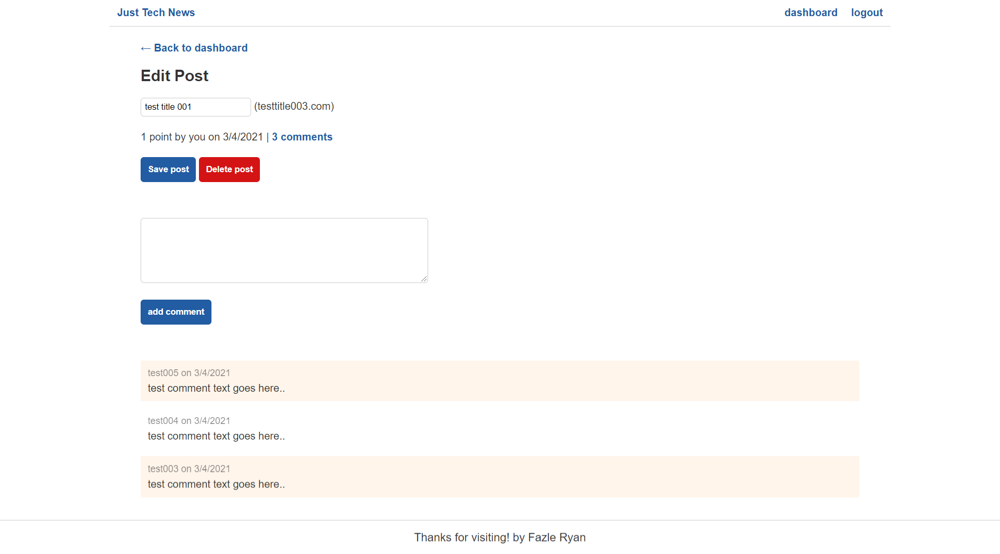

# just-tech-news

Back end developed for just tech news with the following functions:

## Screenshot:

### Users:

- Create new users. 
    Api Route: https://ryan7998-just-tech-news.herokuapp.com/api/users
    Method: Post
    json format:  {
	 "username": "username",
	 "email": "mailaddress@mail.com",
	 "password": "anypassword"
    }

- Get All User records: 
    API Route: https://ryan7998-just-tech-news.herokuapp.com/api/users
    Method: Get

- Get User record by ID:
    API Route: https://ryan7998-just-tech-news.herokuapp.com/api/users/:id
    Method: Get

- User Login:
    API Route: https://ryan7998-just-tech-news.herokuapp.com/api/users/login
    Method: POST
    json format:  
    {
		"email": "test001@mail.com",
	 	"password": "user1234"
    }
- User Update:
    API Route: https://ryan7998-just-tech-news.herokuapp.com/api/users/:id
    Method: PUT

- User Delete:
    API Route: https://ryan7998-just-tech-news.herokuapp.com/api/users/:id
    Method: DELETE

### POST:

- Get all Posts:
    API Route: https://ryan7998-just-tech-news.herokuapp.com/api/posts
    Method: GET
    - gets details of post with vote count from vote table, comments from comments table and username from user table

- Get post by ID:
    API Route: https://ryan7998-just-tech-news.herokuapp.com/api/posts/:id
    Method: GET
    - gets details of post by id, with vote count from vote table, comments from comments table and username from user table

- Create new post:
    API Route: https://ryan7998-just-tech-news.herokuapp.com/api/posts/:id
    Method: POST
    json format:
     {
        "title": "test title 002",
        "post_url": "testtitle002.com",
        "user_id": 1
    }

- Vote On a post:
    API Route: https://ryan7998-just-tech-news.herokuapp.com/api/posts/upvote
    Method: PUT
    json format:
    {
        "user_id": 1,
        "post_id": 2
    }

- Delete a post by ID:
    API Route: https://ryan7998-just-tech-news.herokuapp.com/api/posts/:id
    Method: DELETE

### COMMENTS:

- Get all comments:
    API Route: https://ryan7998-just-tech-news.herokuapp.com/api/comments
    Method: GET

- Create new comment:
    API Route: https://ryan7998-just-tech-news.herokuapp.com/api/comments
    Method: POST
    json format:
    {
        "comment_text": "test comment text goes here..",
        "user_id": 3,
        "post_id": 3
    }

- Delete comment by ID:
    API Route: https://ryan7998-just-tech-news.herokuapp.com/api/comments/:id
    Method: DELETE

Link to the site: https://ryan7998-just-tech-news.herokuapp.com/api/posts